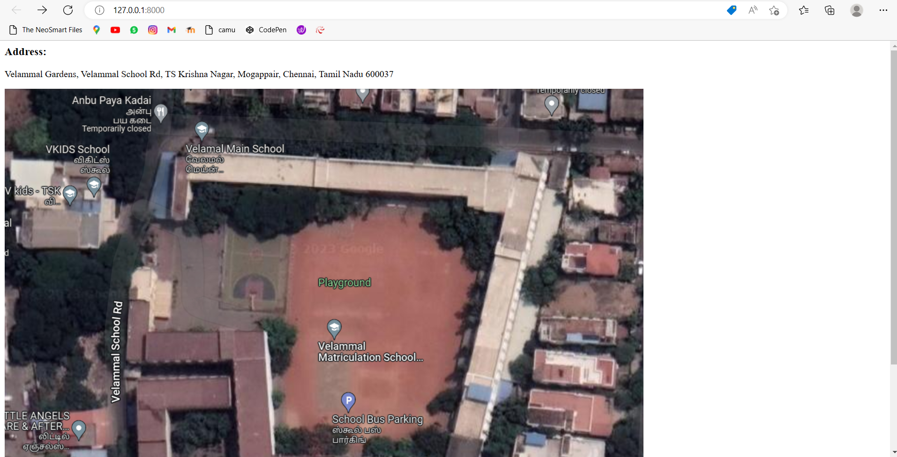

# Places Around Me
## AIM:
To develop a website to display details about the places around my house.

## Design Steps:

## Step 1:
Create a new django project and app

## Step 2:
Add a new imagemap html file in templates and neede images in static folder and define it in settings.

## Step 3:
Type ur image map code in the html with coordinates and target file to redirect on click

## Step 4:
Define your components pages and create content in such a way that it gives information about place which is being clicked

## Step 5:
Include pictures and contents for your subpages and map them using urls and views

## Code:
```html


<html>
    <head>
        <title>SEC</title>
        <link rel="stylesheet" type="text/css" href="">
    </head>
    <body>

        <h3>Address:</h3><p> Velammal Gardens, Velammal School Rd, TS Krishna Nagar, Mogappair, Chennai, Tamil Nadu 600037</p>
        
        
<map name="image-maps-2023-01-09-153552" id="ImageMapsCom-image-maps-2023-01-09-153552">
<area id="v-kids" alt="" title="v-kids" href="vkids" shape="rect" coords="0,89,215,286" style="outline:none;" target="_self"     />
<area id="primary" alt="" title="primary" href="primary" shape="rect" coords="305,100,928,249" style="outline:none;" target="_self"     />
<area id="middileclass" alt="" title="middileclass" href="middileclass" shape="rect" coords="770,250,889,610" style="outline:none;" target="_self"     />
<area id="ground" alt="" title="ground" href="ground" shape="rect" coords="467,249,715,619" style="outline:none;" target="_self"     />
<area id="highschool" alt="" title="highschool" href="highschool" shape="rect" coords="210,378,462,703" style="outline:none;" target="_self"     />
<area id="highsecondary" alt="" title="highsecondary" href="highsecondary" shape="rect" coords="481,622,746,760" style="outline:none;" target="_self"     />
<area shape="rect" coords="1088,810,1090,812" alt="Image Map" style="outline:none;" title="Image Map" href="https://www.image-maps.com/" />
</map>

    </body>
</html>
```

## Output:


## Result:
Thus a website is developed to display details about my school near my house